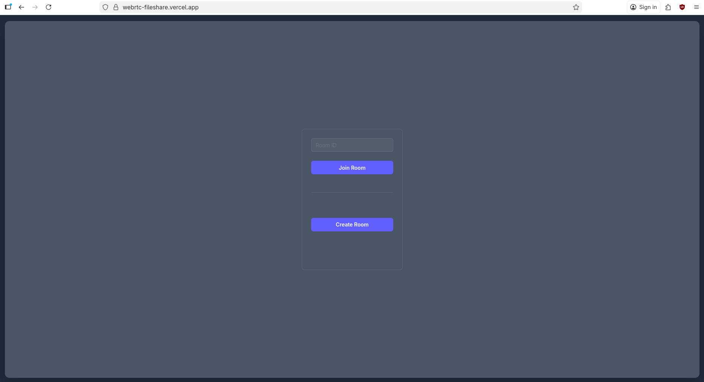
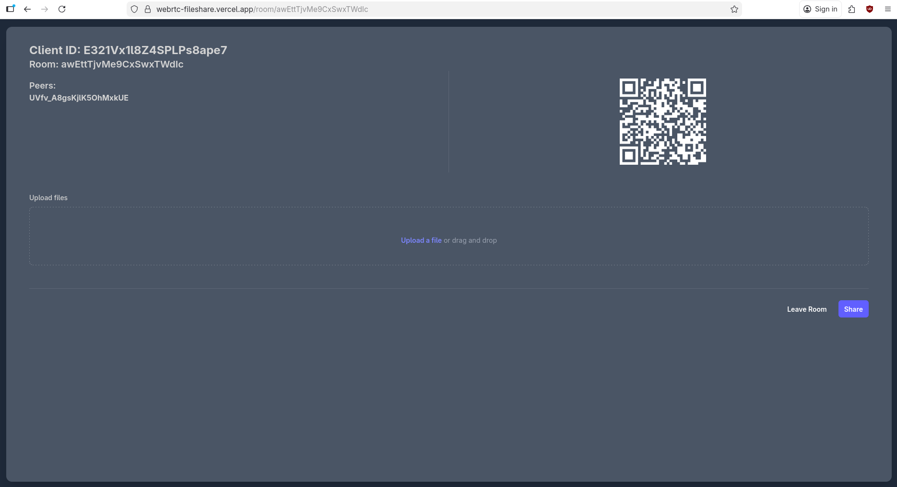

# WebRTC file transfer app

## Usage:

Create or join a room by scanning a QR or entering room id.

Wait for peers, select file, transfer files.

# Features

Server side

> WS signaling server + express http server on the backend.
>
> Supports multiple rooms.
>
> Rooms currently in memory.

Client side

> After peer connection one data channel is opened for each file to be transfered
>
> Files are chunked and sent from sender to receiver

Try app at: (https://webrtc-fileshare.vercel.app/)
